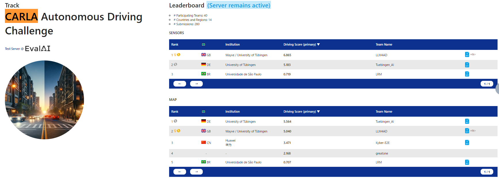
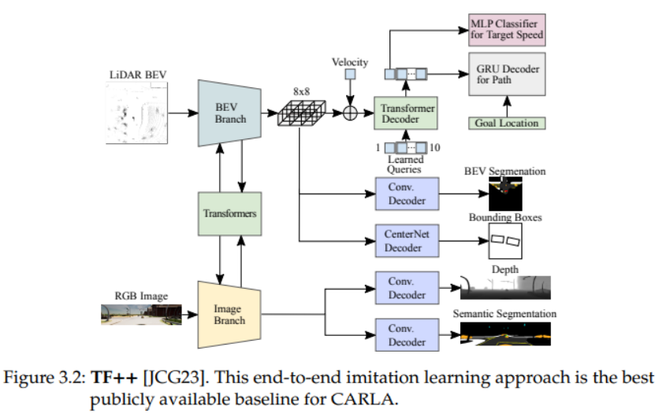
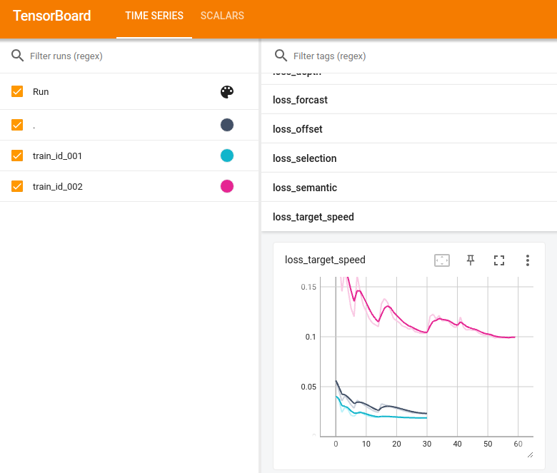

# CARLA Autonomous Driving Challenge Leaderboard2.0を動かしてみた

## はじめに

本記事では、CARLA Autonomous Driving Challenge Leaderboard2.0の概要を説明した上で、2024年入賞されたteamがソフトを公開されたので試しに動かしてみた際のトライ&エラーの内容を紹介します。

なお、本記事は、主に以下の論文を参考に記載しています。

[Tackling CARLA Leaderboard 2.0 with
End-to-End Imitation Learning](https://kashyap7x.github.io/assets/pdf/students/Zimmerlin2024.pdf)

## 動作環境

本記事で動確した際のPCスペックを記載しておきます。

OS: Ubuntu 22.04.5 LTS

CPU: intel core i9 10850K

マザーボード: intel Z490

メモリ: HyperX Fury RGB 64GB

グラボ: NVIDIA GeForce RTX 3090

SSD: WD_Black 1TB

HDD: 2TB

## CARLA Autonomous Driving Challenge Leaderboard2.0

現実的な交通条件下で自律エージェントの運転性能を評価することを目的とした、学術界や産業界の参加者向けの公開コンペティションです。

公式サイト：[Autonomous Grand Challenge](https://opendrivelab.com/challenge2024/)



上記のランキング表を見てわかる通り、LeaderBoard2.0には、SENSORSトラックとMAPトラックの2つのトラックがあります。

### **SENSORSトラック**

最大8台のRGBカメラ、2台のLIDARセンサー、4台のRADAR、1台のGNSSセンサー、1台の慣性測定ユニット（IMU）、および速度計の使用が許可されています。

### **MAPトラック**

SENSORSトラックのすべてのセンサーに加え、高解像度（HD）マップ（OpenDRIVE形式）が追加されます。このマップは、密なウェイポイントのネットワークとして車線や曲がり角を含む道路ネットワークをエージェントに提供されています。そのため、HDマップを使用せずにSENSORSトラック用に開発されたモデルもMAPトラックに提出可能です。センサーデータに加えて、エージェントはターゲットポイント（最大200メートル間隔）を通じて、進むべき道や曲がる方向の情報を受け取ることができます。


以前のバージョンであるCARLA Leaderboard 1.0では、参加者は1～2キロメートルのテストルートを走行し、6つの交通シナリオに直面するというタスクが課されました。このコンペティションは自動運転コミュニティから大きな関心を集め、高度なセンサーフュージョン技術、強化学習を用いた自動運転システムが開発され、結果として、スコアは2020年のリーダーボード開始当初の10DS未満から、2023年にはほぼ80DS（最大値は100DS）に大幅に向上しました。（スコアに関しては後述）

スコアが飽和に近づいたため、CARLAチームは新しいより困難な課題を提供するCARLA Leaderboard 2.0が2024年度から導入されています。Leaderboard 2.0では、各10平方キロメートルの3つの新しい大規模マップが導入されました。このうち、Town12とTown13はトレーニングおよびバリデーション用として公開されており、Town14はテストタウンとして使用されます。これらのマップは、都市の中心部、郊外、田舎道など多様な環境を含んでおり、この新しいマップでは、異なる交通パターンへの適応が必要な多様な環境、最高時速120km/hの高速道路での安全なナビゲーション、および38の新しい複雑なシナリオに対応する必要があります。

Leaderboard 1.0とは異なり、Leaderboard 2.0のテストルートは大幅に長く、平均約10キロメートルであり、エージェントは多くのシナリオを連続して解決する必要があり、その結果、リーダーボードスコアは再び一桁台に戻っており、昨年の優勝チームでも100点満点中の6点台にとどまっています。

## 評価基準

CARLA Leaderboard 2.0では、エージェントの性能を評価するために、以下の3つの主要な指標が使用されます：

**ドライビングスコア（DS）**、**ルート完了度（RC）**、および**違反スコア（IS）**

**ドライビングスコア（DS）**:

 最も重要な指標であり、リーダーボードの順位を決定するために使用されます。スコアは0から100の範囲で、他の2つの主要指標の積で定義されます。

DS=RC×IS

**ルート完了度（RC）**: 

エージェントがルートをどの程度完了したかを0から100のスケールで測定します。このスコアには、車両が道路上を移動した距離のみが含まれます。道路外を走行した距離は計算から除外されます。

**違反スコア（IS）**: 

0から1の範囲で、交通ルール違反を乗算的に測定します。

IS = 0.5^{Ped} * 0.6^{Veh} * 0.65^{Stat} * 0.7^{Red} * 0.7^{Yie} * 0.7^{Sce} * 0.8^{Sto}

各違反タイプは、重度の順に以下の通りです：

Ped: 歩行者との衝突、ペナルティ係数0.5

Veh: 車両との衝突、ペナルティ係数0.6

Stat: 静的なレイアウト（例: ガードレール）との衝突、ペナルティ係数0.65

Red: 赤信号無視、ペナルティ係数0.7

Yie: 緊急車両への譲歩失敗、ペナルティ係数0.7

Sce: 自車両が無期限にブロックされる可能性のあるシナリオでは、4分間のタイムアウト後に自車両がルートを続行しますが、ペナルティ係数0.7が適用されます

MinSp: 周囲の交通の速度に基づいて計算される最低速度を維持することが求められます。この速度を維持できない場合、1から0.7の範囲でペナルティが発生します。この違反タイプは、簡略化のため上記の式には含まれていません。また、短いルートでの違反が避けられない場合が多いため、Town13 ShortベンチマークでのIS計算から除外されています

Sto: 一時停止標識の無視、ペナルティ係数0.8

Blo: 他車両によるブロックなどで180秒間動作しない場合、シミュレーションが終了します。ただし、この場合、違反スコアにペナルティは加算されません（ただし、ルート完了度を妨げます）

## 2024年入賞チームのコードを動かす

さっそくCARLAシミュレーション環境を動かしてみたいと思います。
2024年大会でMAPトラック部門１位、SENSORSトラック部門２位のチームがコードと学習済みモデルを公開していただいているので、そちらを参考に動かしてみます。 

公式サイト：
[carla_garage](https://github.com/autonomousvision/carla_garage?tab=readme-ov-file)

このコードで用いられているアーキテクチャは以下の通りで、LidarとCameraデータをFusionすることで他車両や人を回避した目標起動を生成し、下流のPIDコントローラにより車両操作量を出力している構成となっていました。



参照：[https://opendrivelab.github.io/Challenge%202024/carla_Tuebingen%20AI.pdf](https://opendrivelab.github.io/Challenge%202024/carla_Tuebingen%20AI.pdf)

上記githubページのReadmeに従えば、環境構築からソフト実行まで実施可能ですが、
参考までに私の動作環境でパス設定等を行った実行スクリプトは以下になります。

[run_leaderboard.sh](https://github.com/akodama428/carla_garage/blob/leaderboard_2/leaderboard/run_leaderboard.sh)

また、team_code/config.pyの中のself.debug=True（デフォルトFalse）にすることで、
各ステップでのカメラ画像とBEV等の中間予測データが画像として出力されます。
出力されたが画像を動画にすると以下のような結果となります。


## 追加学習

苦手なシーンを追加するためにデータを生成します。
上記のリポで公開していただいてる、シーン別に細かくシナリオを切って実行可能なBench2Driveと、地図データや他車両の位置情報等を使用したデータ生成用のAgentとしてPDM Liteを使用します。

基本はReadme記載の通りで動くはずですが、パス設定等でハマったので、私の個人PC環境で動かした際の設定ファイルを共有しつつ、手順を簡単にまとめます。

### １．Bench2Driveのシナリオ設定

PDM_Liteを使用する際のシナリオ設定ファイルは、bench2drive220_0_pdm_lite_traj.xmlで管理されています。１例として、左折シーンのみ抽出したxmlファイルです。

[bench2drive220_0_pdm_lite_traj.xml](https://github.com/akodama428/carla_garage/blob/leaderboard_2/Bench2Drive/leaderboard/data/bench2drive220_0_pdm_lite_traj.xml)


### ２．学習データ生成

PDM Liteは、以下のリポを参考にstart_expert_local.shを実行することで生成します。
（こちらは、Bench2Driveのリポとは別のリポになるので、手元で動かす際は別途クローンし、readmeに従って仮想環境を構築してください）

[start_expert_local.sh](https://github.com/akodama428/DriveLM/blob/DriveLM-CARLA/pdm_lite/start_expert_local.sh)

### ３．学習

生成されたデータをもとに以下のスクリプトを実行すると学習を回すことができます。

[shell_train.sh](https://github.com/akodama428/carla_garage/blob/leaderboard_2/team_code/shell_train.sh)

なお、学習の進捗状況は以下のコマンドでTensorBoardで確認できます。
```bash
tensorboard --logdir=<モデル保存フォルダパス>
```


以上で追加学習自体はできますが、今回はお試しで実施したので、データ量が足りないためか再学習後の性能は悪化しています。
今後はどのようなデータセットで追加学習していくべきかを検討していきたいと思います。


---

個人的な所感ですが、自宅PCでデータ駆動型の自動運転システムが実行できることに感動しつつ、
合流や右左折のシーンでは他車両と衝突するシーンも見られたため、改善の余地はまだまだありそうだなという印象です。
CARLAの環境を使い、手元で動かしながら公開コードを確認することで、楽しみながら最新技術動向をキャッチアップできると思うので、ぜひ試してみてください！