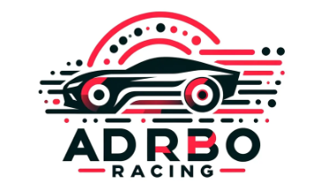

 Carla Autonomous Driving Challengeに日本の国旗を載せたい  
---

  

## 背景  
我々のチームは2024年の自動運転AIチャレンジに参加し、**オープンソース（OSS）を組み合わせることで高度な自動運転を比較的簡単に実現できる未来がすぐそこまで来ている**ことを実感しました。  

次の目標として、より複雑な環境下での自動運転の実現に挑戦すべく、[Autonomous Grand Challengeの一つであるCARLA Autonomous Driving Challenge](https://opendrivelab.com/challenge2024/#carla)に参加し、最新技術のキャッチアップをしていきたいと考えています。

上記リンク先のサイトでは、自動運転に関するさまざまなコンテストが毎年開催されており、上位チームの結果が公開されています。しかし、残念ながら日本のチームが一つも入賞していないのが現状です。  

そこで本記事では、**CARLA AD Challengeの環境下での取り組みやトライ＆エラーの過程を紹介し、少しでもこのコンテストへの参加者や興味を持つ方が増えるきっかけになれば**と思っています。
欧米・中国勢にキャッチアップするのは、超ハードルが高いと感じつつも、得られた知見を共有していくことで、
日本のteamが上位ランクインすることを目指します。

## 記事一覧  

- [CARLA AD Challenge LeaderBoard2.0を動かしてみた](./doc/article20241217.md)  
